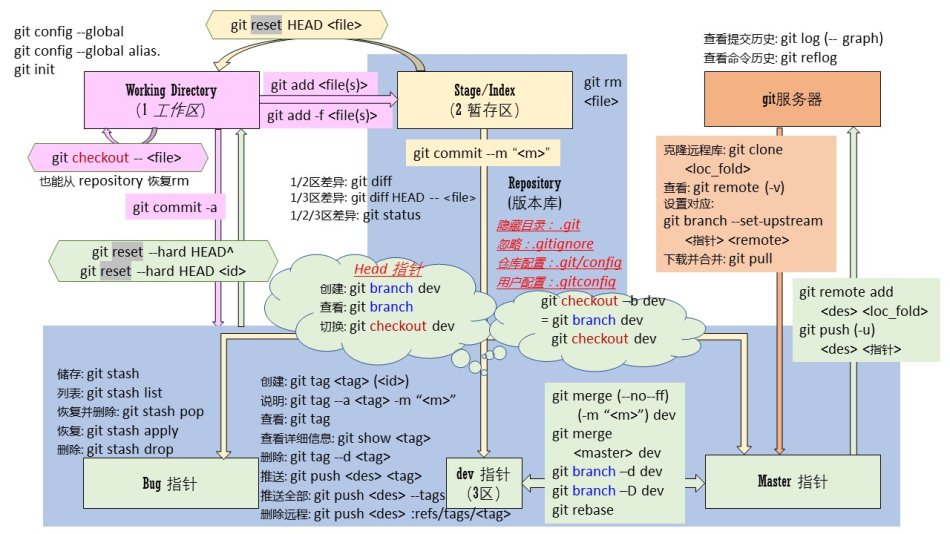

# learn_git

## 1.git简介
git是什么？  

git是目前世界上最先进的分布式版本控制系统（没有之一）。
### (1) 集中式VS分布式
集中式和分布式版本控制系统有什么区别呢？
  
先说集中式版本控制系统，版本库是集中存放在中央服务器的，而干活的时候，用的都是自己的电脑，所以要先从中央服务器上取得最新的版本，然后开始干活，干完活了，再把自己的活推送给中央服务器。 
 
集中式版本控制系统最大的毛病就是必须联网才能工作。 
 
分布式版本控制系统根本没有“中央服务器”，每个人的电脑上都是一个完整的版本库，这样，你工作的是后，就不需要联网，因为版本库就在你自己的电脑上。既然每个人的电脑都有一个完整的版本库，那多个人协作呢？比方说你在自己的电脑上改了文件A，你的同事也在他的电脑上改了文件A，这试，你们俩之间只需要把各自的修改推送给对方，就可以互相看到各自的修改了。
### (2) 安装git
在Windows上使用Git，可以从Git官网直接下载安装程序，（网速慢的同学请移步国内镜像），然后按默认选项安装即可。

安装完成后，在开始菜单里找到“Git”->“Git Bash”，蹦出一个类似命令行窗口的东西，就说明Git安装成功！

安装完成后，还需要最后一步设置，在命令行输入：  
```
$ git config --global user.name "Your Name"
$ git config --global user.email "email@example.com"
```
因为Git是分布式版本控制系统，所以，每个机器都必须自报家门：你的名字和Email地址。你也许会担心，如果有人故意冒充别人怎么办？这个不必担心，首先我们相信大家都是善良无知的群众，其次，真的有冒充的也是有办法可查的。
### (3) 创建版本库
什么是版本库呢？版本库又名仓库，英文名repository，你可以简单理解成一个目录，这个目录里面的所有文件都可以被Git管理起来，每个文件的修改、删除，Git都能跟踪，以便任何时刻都可以追踪历史，或者在将来某个时刻可以“还原”。  

所以，创建一个版本库非常简单，首先，选择一个合适的地方，创建一个空目录：  
```
$ mkdir learngit
$ cd learngit
```  
第二步，通过git init命令把这个目录变成Git可以管理的仓库：  
```
$ git init
```  
现在我们编写一个readme.txt文件，内容如下：  
```
Git is a version control system.
Git is free software.
```  
第一步，用命令git add告诉Git，把文件添加到仓库：  
```
$ git add readme.txt
```  
第二步，用命令git commit告诉Git，把文件提交到仓库：  
```
$ git commit -m "wrote a readme file"
```  
简单解释一下git commit命令，-m后面输入的是本次提交的说明，可以输入任意内容，当然最好是有意义的，这样你就能从历史记录里方便地找到改动记录。

## 2.版本管理
### (1) 修改文件
我们已经成功地添加并提交了一个readme.txt文件，现在，是时候继续工作了，于是，我们继续修改readme.txt文件，改成如下内容：  
```
Git is a distributed version control system.
Git is free software.
```
现在，运行git status命令看看结果：  
```
$ git status
On branch master
Your branch is ahead of 'origin/master' by 2 commits.
  (use "git push" to publish your local commits)
Changes not staged for commit:
  (use "git add <file>..." to update what will be committed)
  (use "git checkout -- <file>..." to discard changes in working directory)
        modified:   readme.txt
no changes added to commit (use "git add" and/or "git commit -a")
```  
git status命令可以让我们时刻掌握仓库当前的状态，上面的命令输出告诉我们，readme.txt被修改过了，但还没有准备提交的修改。  
虽然Git告诉我们readme.txt被修改了，但如果能看看具体修改了什么内容，自然是很好的。比如你休假两周从国外回来，第一天上班时，已经记不清上次怎么修改的readme.txt，所以，需要用git diff这个命令看看：  
```
$ git diff readme.txt
diff --git a/readme.txt b/readme.txt
index d8036c1..013b5bc 100644
--- a/readme.txt
+++ b/readme.txt
@@ -1,2 +1,2 @@
-Git is a version control system.
+Git is a distributed version control system.
 Git is free software.
\ No newline at end of file
```
### (2) 版本回退
在Git中，git log命令显示从最近到最远的提交日志：  
```
$ git log
commit f1be8eaa85d05a7aff6c76a998494578ffe8b690 (HEAD -> master)
Author: leicj <448439793@qq.com>
Date:   Mon Jul 2 15:26:40 2018 +0800
    add distributed
commit 08830415c6036a27e3f785e7de9ac4e206e4f487
Author: leicj <448439793@qq.com>
Date:   Mon Jul 2 15:21:54 2018 +0800
    wrote a readme file
```  
如果嫌输出信息太多，看得眼花缭乱的，可以试试加上--pretty=oneline参数：  
```
leich@lile-pc MINGW64 ~/learngit (master)
$ git log --pretty=oneline
f1be8eaa85d05a7aff6c76a998494578ffe8b690 (HEAD -> master) add distributed
08830415c6036a27e3f785e7de9ac4e206e4f487 wrote a readme file
```  
好了，我们准备把readme.txt回退到上一个版本，也就是wrote a readme file的那个版本  
首先，Git必须知道当前版本是哪个版本，在Git中，用HEAD表示当前版本，也就是最新的提交f1be8eaa85...（注意我的提交ID和你的肯定不一样），上一个版本就是HEAD^，上上一个版本就是HEAD^^，当然往上100个版本写100个^比较容易数不过来，所以写成HEAD~100。

现在，我们要把当前版本add distributed回退到上一个版本wrote a readme file，就可以使用git reset命令：
```
$ git reset --hard HEAD^
```  
### (3) 工作区和暂存区
#### 工作区（Working Directory）
就是你在电脑里能看到的目录，比如我的learngit文件夹就是一个工作区  
#### 版本库（Repository）
工作区有一个隐藏目录.git，这个不算工作区，而是Git的版本库。  
Git的版本库里存了很多东西，其中最重要的就是称为stage（或者叫index）的暂存区，还有Git为我们自动创建的第一个分支master，以及指向master的一个指针叫HEAD。  
  
前面讲了我们把文件往Git版本库里添加的时候，是分两步执行的：  

第一步是用git add把文件添加进去，实际上就是把文件修改添加到暂存区；  

第二步是用git commit提交更改，实际上就是把暂存区的所有内容提交到当前分支。  
### (4) 撤销修改
自然，你是不会犯错的。不过现在是凌晨两点，你正在赶一份工作报告，你在readme.txt中添加了一行：
```
$ cat readme.txt
Git is a distributed version control system.
Git is free software distributed under the GPL.
Git has a mutable index called stage.
Git tracks changes of files.
My stupid boss still prefers SVN.
```
在你准备提交前，一杯咖啡起了作用，你猛然发现了stupid boss可能会让你丢掉这个月的奖金！

既然错误发现得很及时，就可以很容易地纠正它。你可以删掉最后一行，手动把文件恢复到上一个版本的状态。如果用git status查看一下：
```
$ git status
On branch master
Changes not staged for commit:
  (use "git add <file>..." to update what will be committed)
  (use "git checkout -- <file>..." to discard changes in working directory)

    modified:   readme.txt

no changes added to commit (use "git add" and/or "git commit -a")
```
你可以发现，Git会告诉你，git checkout -- file可以丢弃工作区的修改：
```
$ git checkout -- readme.txt
```
命令git checkout -- readme.txt意思就是，把readme.txt文件在工作区的修改全部撤销，这里有两种情况：

一种是readme.txt自修改后还没有被放到暂存区，现在，撤销修改就回到和版本库一模一样的状态；

一种是readme.txt已经添加到暂存区后，又作了修改，现在，撤销修改就回到添加到暂存区后的状态。

总之，就是让这个文件回到最近一次git commit或git add时的状态。

现在，看看readme.txt的文件内容：
```
$ cat readme.txt
Git is a distributed version control system.
Git is free software distributed under the GPL.
Git has a mutable index called stage.
Git tracks changes of files.
```
文件内容果然复原了。

git checkout -- file命令中的--很重要，没有--，就变成了“切换到另一个分支”的命令，我们在后面的分支管理中会再次遇到git checkout命令。  
现在假定是凌晨3点，你不但写了一些胡话，还git add到暂存区了：
```
$ cat readme.txt
Git is a distributed version control system.
Git is free software distributed under the GPL.
Git has a mutable index called stage.
Git tracks changes of files.
My stupid boss still prefers SVN.
```
$ git add readme.txt
庆幸的是，在commit之前，你发现了这个问题。用git status查看一下，修改只是添加到了暂存区，还没有提交：
```
$ git status
On branch master
Changes to be committed:
  (use "git reset HEAD <file>..." to unstage)

    modified:   readme.txt
```
Git同样告诉我们，用命令git reset HEAD <file>可以把暂存区的修改撤销掉（unstage），重新放回工作区：
```
$ git reset HEAD readme.txt
Unstaged changes after reset:
M    readme.txt
```
git reset命令既可以回退版本，也可以把暂存区的修改回退到工作区。当我们用HEAD时，表示最新的版本。

再用git status查看一下，现在暂存区是干净的，工作区有修改：
```
$ git status
On branch master
Changes not staged for commit:
  (use "git add <file>..." to update what will be committed)
  (use "git checkout -- <file>..." to discard changes in working directory)

    modified:   readme.txt
```
还记得如何丢弃工作区的修改吗？
```
$ git checkout -- readme.txt

$ git status
On branch master
nothing to commit, working tree clean
```
整个世界终于清静了！
## 3.远程仓库


